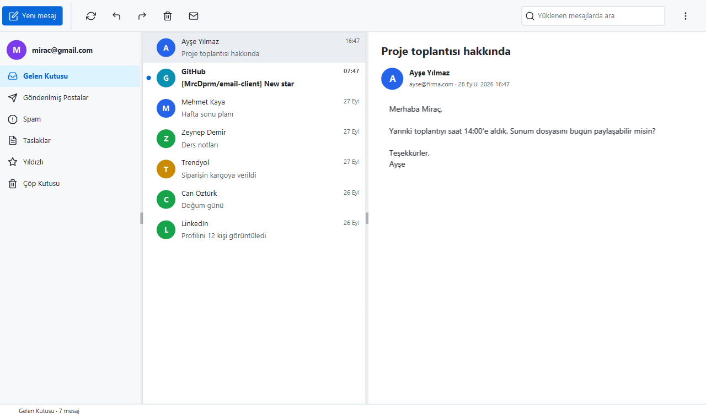
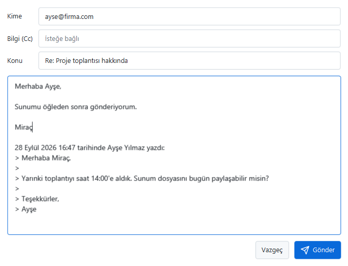
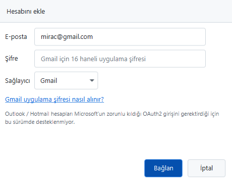

<p align="center">
  
</p>

<h1 align="center">Email Client</h1>

<p align="center">
  <a href="README.md">English</a> | <b>Türkçe</b>
</p>

<p align="center">
  Java ve JavaFX ile yazılmış masaüstü e-posta istemcisi. Jakarta Mail ile IMAP üzerinden e-postaları okur,<br>
  SMTP üzerinden gönderir; modern bir arayüzü var ve şifreyi şifreli olarak saklar.
</p>

<p align="center">
  <a href="https://github.com/MrcDprm/email-client/releases/latest"><b>⬇️ Windows için indir</b></a>
</p>

<p align="center">
  
</p>

## Özellikler

**Okuma (IMAP)**
- Simgeli klasörler (Gelen Kutusu, Gönderilmiş, Taslaklar, Spam, Çöp, Yıldızlı…), en yeni mesaj en üstte
- "Daha fazla yükle" ile sayfalama (30'ar mesaj), yüklenen mesajlarda arama
- Gönderen avatarlı okuma bölmesi; okunmamış mesajlar kalın ve mavi noktalı
- Okundu / okunmadı yapma, silme (Çöp Kutusu'na taşır)
- Değişiklikler sunucuda yapılır, bu yüzden Gmail'in web ve telefon uygulamasıyla senkron kalır
- HTML e-postalar **düz metin** olarak gösterilir: betikler ve uzak içerik asla çalışmaz

**Yazma (SMTP)**
- Yeni mesaj, **yanıtla** (alıntılı, `Re:` konulu, aynı konuşmada kalır) ve **ilet**
- Kime ve Bilgi (Cc) alanlarında birden fazla adres; her adres doğrulanır, hatalı olan adıyla gösterilir
- Ctrl+Enter ile gönderme, konu boşsa uyarı, gönderilmemiş mesajı kapatırken onay
- Gönderim arka planda yapılır; pencere ancak mesaj gerçekten gidince kapanır

**Hesap ve güvenlik**
- Gmail, Yandex ve iCloud için hazır ayarlar (adresten otomatik tanınır) ya da özel IMAP/SMTP sunucusu
- Hesap kaydedilmeden önce giriş hem IMAP hem SMTP'de denenir
- Şifre **Windows DPAPI** ile şifrelenir; asla düz metin olarak saklanmaz
- Sunucu sertifikaları doğrulanır, STARTTLS zorunludur; şifre hiçbir zaman şifresiz gitmez
- Teknik ayrıntı yerine anlaşılır hata mesajları (yanlış şifre, bağlantı yok, zaman aşımı…)
- Hesaptan çıkınca kayıtlı hesap bilgisayardan silinir

**Arayüz**
- Modern tema (AtlantaFX), Feather simgeleri, renkli avatarlar
- Arayüz asla donmaz: bütün e-posta işlemleri arka plan iş parçacığında çalışır
- Sunucu bağlantıyı kapatırsa otomatik yeniden bağlanma
- Kısayollar: Ctrl+N yeni mesaj, Ctrl+R yanıtla, F5 yenile, Delete sil

## Ekran Görüntüleri

| Yanıtla | Hesap kurulumu |
|:---:|:---:|
|  |  |

## Kurulum

1. [Releases](https://github.com/MrcDprm/email-client/releases/latest) sayfasından `EmailClient-1.0.0-Setup.exe` dosyasını indir ve çalıştır. Java kurmana gerek yok, kurulumun içinde geliyor.
2. İlk açılışta e-posta adresini ve şifreni gir.

**Gmail:** Google, e-posta uygulamalarında normal şifreni kabul etmez. İki adımlı doğrulamayı aç, sonra [myaccount.google.com/apppasswords](https://myaccount.google.com/apppasswords) adresinden 16 haneli bir **uygulama şifresi** oluşturup uygulamada onu kullan.

> **Outlook / Hotmail** hesapları desteklenmiyor: Microsoft bu hesaplarda sadece OAuth2 ile girişe izin veriyor, şifreyle (uygulama şifresiyle) giriş kapatıldı.

Şifreli hesap dosyası `%APPDATA%\EmailClient` klasöründe saklanır. Kaldırma işlemi Windows'un "Uygulamalar" ekranından yapılır.

## Kullanılan Teknolojiler

- **Java 21**, **Maven**
- **JavaFX 21**: arayüz
- **Jakarta Mail (Eclipse Angus)**: IMAP ve SMTP
- **AtlantaFX** (tema), **Ikonli + Feather** (simgeler)
- **jsoup**: HTML e-postaları düz metne çevirme
- **JNA**: Windows DPAPI şifreleme
- **JUnit 5** + **GreenMail**: bellekte çalışan e-posta sunucusuyla testler
- **jpackage** + **Inno Setup**: Windows kurulum dosyası

## Proje Yapısı

```
src/main/java/com/mrcdprm/emailclient/
├── mail/        Hesap modeli, sağlayıcı ayarları, IMAP okuyucu, SMTP gönderici, HTML'den düz metne
├── security/    Şifrenin Windows DPAPI ile şifrelenmesi
├── settings/    Hesabın kullanıcı klasörüne kaydedilmesi, ortam değişkenleri
├── ui/          Ana ekran, hesap kurulumu, mesaj yazma, hakkında, avatarlar, simgeler
├── EmailClientApp.java
└── Launcher.java
src/test/java/   JUnit testleri (GreenMail)
installer/       Inno Setup betiği ve ikon
```

## Kaynak Koddan Çalıştırma

JDK 21 ve Maven gerekir.

```
mvn test          # testler
mvn javafx:run    # uygulamayı çalıştır
```

Geliştirme sırasında hesap, kurulum penceresi yerine ortam değişkenlerinden de okunabilir (bkz. `.env.example`):

```
$env:EMAIL_ADDRESS = "sen@gmail.com"
$env:EMAIL_APP_PASSWORD = "uygulama şifren"
mvn javafx:run
```

### Kurulum dosyası oluşturma

[Inno Setup 6](https://jrsoftware.org/isinfo.php) gerekir.

```
powershell -ExecutionPolicy Bypass -File installer\build.ps1
ISCC installer\EmailClient.iss
```

`build.ps1` uygulamayı derler, gereken JDK modüllerini `jdeps` ile bulur ve `jpackage` ile içinde küçültülmüş bir Java çalışma ortamı bulunan `dist\EmailClient` klasörünü oluşturur. Kurulum dosyası `installer\Output\` klasöründe oluşur.

**Yeni sürüm yayınlarken:** sürüm numarasını `pom.xml`, `EmailClientApp.VERSION`, `installer/build.ps1` ve `installer/EmailClient.iss` dosyalarında güncelle, testleri çalıştır, iki komutu çalıştır ve oluşan kurulum dosyasını yeni bir GitHub Release'e yükle.

## Öğrendiklerim

- **E-posta aslında nasıl çalışıyor.** IMAP e-postaları sunucuda tutuyor ve bütün uygulamalar aynı kutuya bakıyor; benim uygulamamda okuduğum, sildiğim ya da işaretlediğim şeyin Gmail'de de görünmesinin sebebi bu. SMTP sadece gönderiyor. Mesajın değişen sıra numarasıyla sabit kalan UID'si arasındaki farkı ve `In-Reply-To` başlığının yanıtı aynı konuşmaya nasıl bağladığını öğrendim.
- **Bir e-posta aslında bir ağaç.** Mesaj iç içe parçalardan oluşuyor: aynı metnin düz metin ve HTML sürümü, bir de ekler. Metni bulmak için bu ağacı gezen özyinelemeli bir fonksiyon yazdım. HTML'yi ekranda çalıştırmak yerine düz metne çevirdim; böylece e-postanın içindeki hiçbir şey çalışamıyor.
- **Arayüzü donmadan çalıştırmak.** Ağ işlemleri saniyeler sürüyor. Bu yüzden onları JavaFX `Task` ile tek bir arka plan iş parçacığında çalıştırıp sonucu arayüze geri getirdim. Kullanıcının sunucudan hızlı tıklama ihtimalini de düşünmem gerekti; geç gelen eski bir cevap yenisinin üzerine yazılmıyor.
- **Varsayılan olarak kapalı gelen güvenlik ayarları.** Jakarta Mail, söylemezseniz sunucu sertifikasını kontrol etmiyor; STARTTLS de sessizce şifresiz bağlantıya düşebiliyor. İki kontrolü de açtım. Şifreyi JNA üzerinden Windows DPAPI ile şifreledim, `toString()` içinde gizledim ve kullanıcıya stack trace yerine anlaşılır mesajlar gösterdim.
- **Java'yı C# ile karşılaştırmak.** Record, `Optional`, lambda, `switch` ifadeleri ve `try`-with-resources tanıdık geldi. Yeni olan "checked exception"lardı: Java, fırlatılabilecek hataları ilan etmeye ve ele almaya zorluyor.
- **"Türkçe i" sorunu.** Türkçe dil ayarlı bir bilgisayarda `"INBOX".toLowerCase()` sonucu `"ınbox"` oluyor. Bu, sağlayıcı tanımayı ve bir klasör simgesini bozdu. Teknik metinlerde `Locale.ROOT`, kullanıcıya gösterilen metinlerde Türkçe yerel ayar kullanarak çözdüm.
- **JavaFX'i CSS ve bir tema kütüphanesiyle biçimlendirmek.** Sabit renk kodları yerine AtlantaFX'in renk değişkenlerini kullandım. Temanın araç çubuğundaki düğmeleri düz gösterdiğini ve mavi "Yeni mesaj" düğmesini odak gidince görünmez yaptığını fark ettim; daha özgül bir CSS kuralıyla düzelttim.
- **Gerçek hesap olmadan test etmek.** GreenMail bellekte gerçek bir IMAP/SMTP sunucusu açıyor; testler Gmail'ime hiç dokunmadan mesaj gönderiyor, okuyor, yanıtlıyor ve siliyor.

## Gelecek Planları

- Eklerin görüntülenmesi ve kaydedilmesi
- İsteğe bağlı HTML görünümü (uzak içerik engellenmiş olarak)
- Birden fazla hesap
- Yeni e-posta bildirimi (IMAP IDLE)
- Outlook / Hotmail ve Gmail için OAuth2 ile giriş
- Koyu tema

## Lisans

[MIT](LICENSE) © 2026 Miraç Deprem
